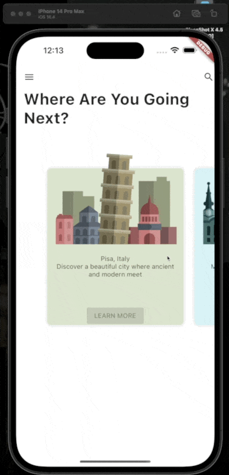

# flutter_parallex_effect:

A demo of the trending parallex effect using Flutter.

```
Download or Clone the Repository to run
```

Simplest way to implement Parallex Effect using only 3 Widgets.

# Demo:

<p align="center">

</p>

 <br/>
 <br/>

# Download Apk

<p align="center">
<a href="https://github.com/deevsaini/parallex_list_flutter/releases/download/1.0.0/app-release.apk">Click to download</a>
</p>
 <br/>
  <p align = "center">Show Some &#128147; by &#11088; the Repositories! </p>
